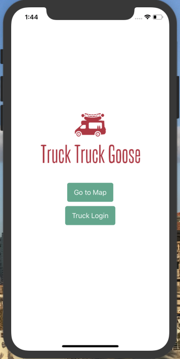

unfortunately, due to GitHub issues, commit history was lost.

# Truck Truck Goose

An app for food trucks to share their location while they are open and for users to see all the trucks that are open and where they are located around town.

### Limited Use

App is only a prototype and not yet on the app store for trucks to use. Hopefully soon!

## Future Implementations

- Build fully authenticated login with the ability for users to create personal profiles, favorite and follow trucks as well as leave comments and reviews for trucks.
- Have push notification functionality so trucks can notify users when they're open and where they are.
- Also have menus and in-app ordering.

